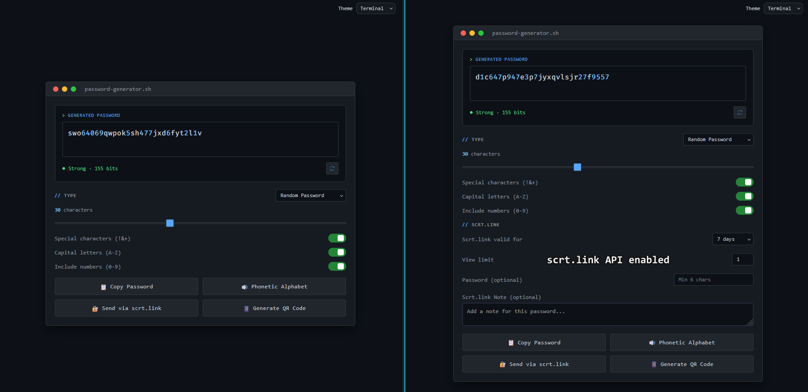

# 🔐 Password Generator

A stylish, client-side password generator with multiple themes and secure sharing via [scrt.link](https://scrt.link). No frameworks, no build step — just open the HTML file and it works.

---



---

## Features

- **Five password modes** — Random, Memorable passphrase, Short memorable, PIN and a 'days from today' calculator.
- **Four themes, one file** — switch between Terminal, Modern, Proton, and CRT from a dropdown, no page reload
- **Entropy-based strength meter** — shows an actual bit estimate (e.g. "Strong · 73 bits"), computed from the real search space for each mode
- **Click to copy** — click the Copy button to copy to clipboard
- **Secure sharing** — send passwords as self-destructing links via the scrt.link API, with configurable expiry (1 hour → 30 days) and view limits (1–1000)
- **QR code generation** — generate a scannable QR code for any password
- **Phonetic alphabet** — expand any password into its NATO phonetic equivalent for reading it out
- **Settings persistence** — your chosen mode, length, toggles, and theme are saved in localStorage and restored on next visit

---

## Themes

| Theme | Description |
|---|---|
| **Terminal** *(default)* | Sleek dark command-line aesthetic |
| **Modern** | Light, soft-shadow UI with a teal accent |
| **Proton** | Clean UI inspired by Proton Apps |
| **CRT** | Retro monochrome display with phosphor glow |

Pick a theme from the dropdown in the top-right corner — the choice is remembered on your next visit. `passgen-old.html` keeps the original standalone look (multiple pre-generated passwords, inspired by musicforprogramming.net) as a separate legacy file, not part of the theme switcher.

---

## Password Modes

| Mode | Description | Configurable |
|---|---|---|
| **Random** | Cryptographically random characters | Length, uppercase, numbers, symbols |
| **Memorable** | Word-based passphrase | Word count (3–10), separator, capitalise, numbers |
| **Short Memorable** | Adjective + noun combos | Word count (2–5), capitalise, symbols, numbers |
| **PIN** | Numeric PIN | Length (4–32 digits) |
| **Date** | A random date within a future range | Days from today (1–730) |

Word lists live in `wordlists.js` and are filtered to remove slurs and hard profanity.

---

## scrt.link Integration

When enabled, the **Send via scrt.link** button creates a one-time secret link for the generated password rather than sending it in plaintext.

Options exposed in the UI:

- **Valid for** — 1 hour, 24 hours, 7 days, or 30 days
- **View limit** — 1, 2, 5, 10 views, or unlimited
- **Password protection** — optional passphrase the recipient must enter to reveal the secret
- **Note** — optional public note attached to the link

A push notification is sent via [ntfy.sh](https://ntfy.sh) when a secret link is created, so you can monitor usage without storing anything server-side.

### Setup

Open `passgen.html` and edit the three constants near the top of the `<script>` block:

```js
const ENABLE_SCRT_INTEGRATION = true;
const SCRT_API_KEY = 'your_scrt_link_api_key_here';
const NTFY_TOPIC  = 'your_ntfy_topic_here';
```

Set `ENABLE_SCRT_INTEGRATION = false` to disable the feature entirely and hide the scrt.link fields.

---

## Usage

No install required.

```bash
git clone https://github.com/your-username/your-repo-name.git
cd your-repo-name
open passgen.html   # or just double-click it
```

Or host it anywhere that serves static files — GitHub Pages, Netlify, Cloudflare Pages, etc.

`wordlists.js` must sit alongside `passgen.html` — the memorable and short-memorable modes fall back to a small built-in word list if it's missing.

---

## File Structure

```
├── images                # Folder with screenshots for index and readme
├── passgen.html           # Main app — all four themes, switchable from the UI
├── wordlists.js           # Word lists for Memorable / Short Memorable modes
├── passgen-old.html       # Legacy standalone "Original" theme
└── scrt-client-module.js  # Local copy of the scrt.link module for fallback
```

`passgen.html` is self-contained beyond `wordlists.js` — no build step, no external dependencies aside from a CDN-loaded QR code library and the scrt.link API module.

---

## Privacy

- All password generation happens **entirely in the browser** — nothing is ever sent to a server
- The scrt.link API call only occurs when you explicitly click **Send via scrt.link**
- Settings are stored in `localStorage` on your own device only

---

## License

MIT
